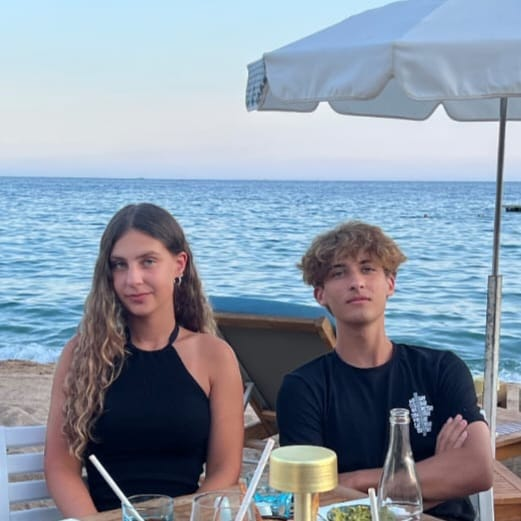

+++
title = "About me"
draft = false
+++

# Who Am I?

Hello! My name is Malik, and I'm currently a student at Gymnasium Kirchenfeld in Switzerland, Bern. I finished the lower secondary school in a progymnasial class at the OS Kerzers in Canton Freiburg, which laid the foundation for my academic journey.
As a major in physics and applied mathematics, I have a passion for learning and exploring these fields. Additionally, I'm excited to delve into the realm of computer science and software development. I'm currently honing my skills in Python programming and learning about web development, including HTML, JavaScript, and CSS.
Beyond academics, I have a passion for sports. One of my main athletic pursuits is volleyball and I’m proud to be part of the 20 unders team at Vopap. 
Looking ahead, my aspirations lie in pursuing higher education at the EPFL, where I aim to study computer science.