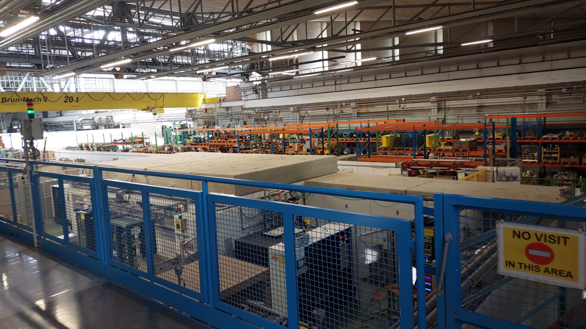
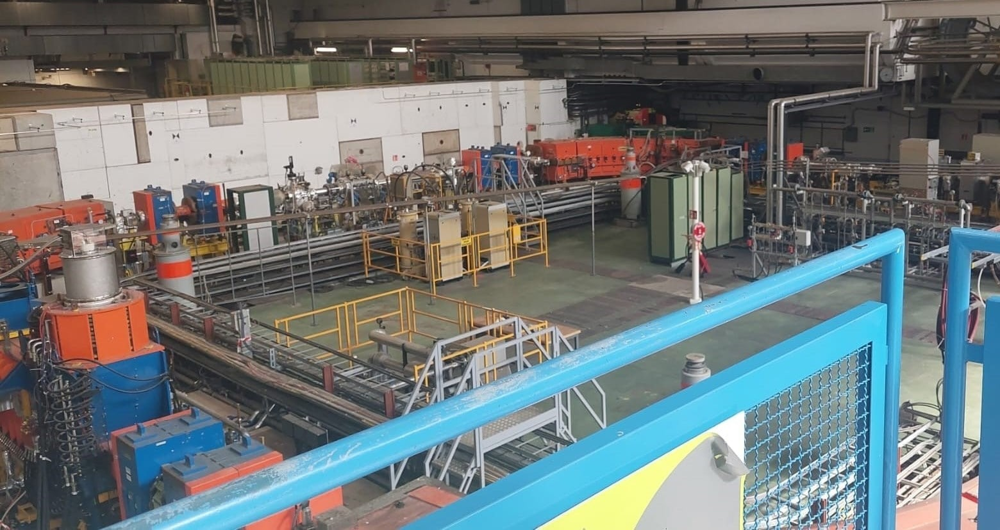
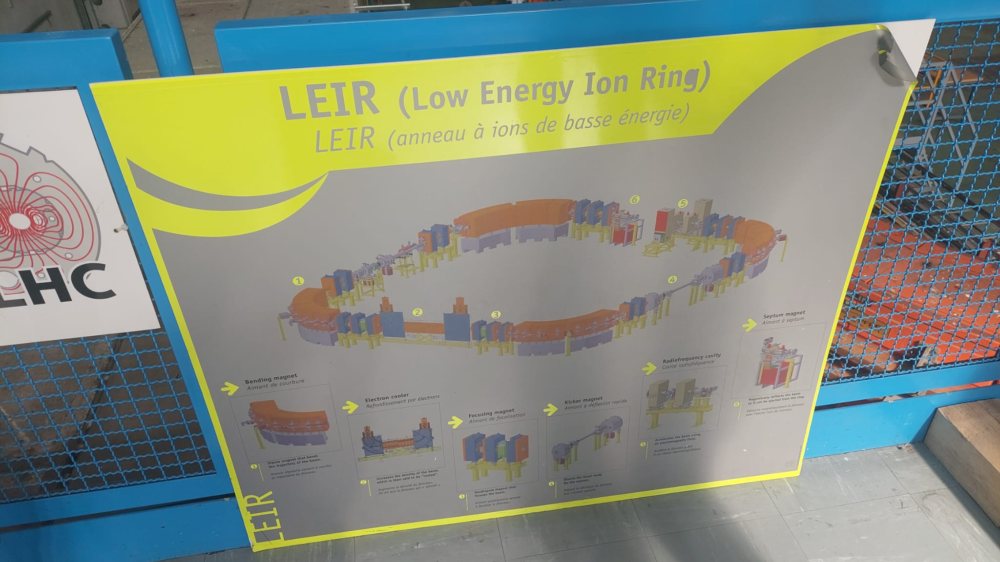
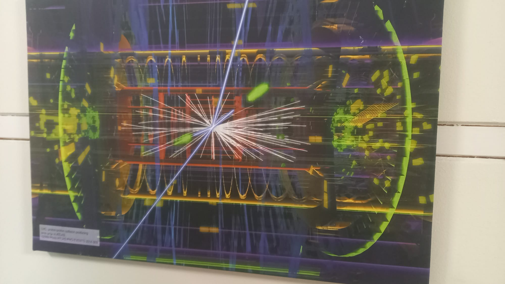
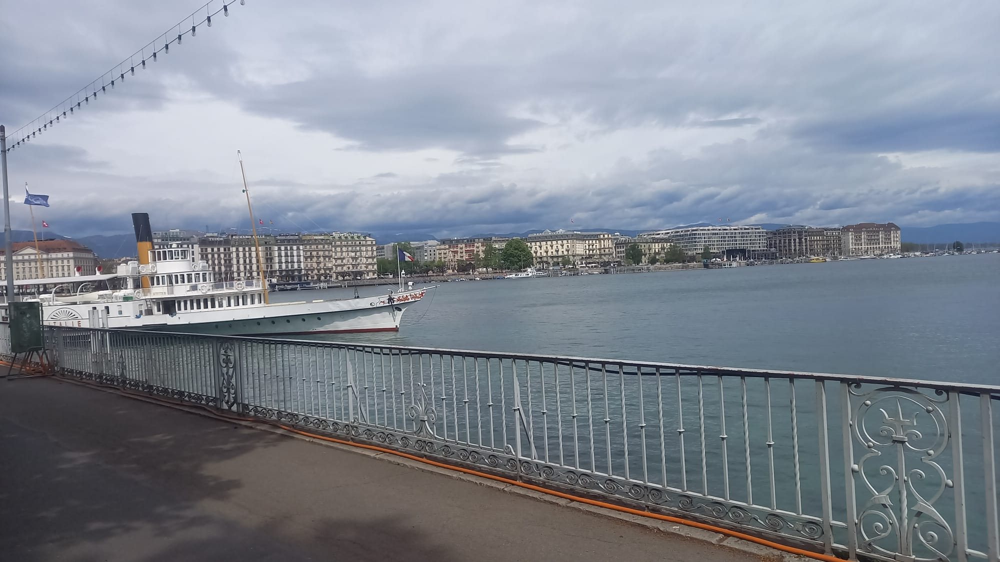

+++
title = "Cern: In der Welt der kleinsten Teilchen"
date = "2023-06-28"
draft = false
pinned = false
tags = ["Deutsch", "Reportage", "Cern"]
image = ""
+++


Menschen sind seit jeher neugierig. Schon immer wollten sie mehr über das Leben, unsere Welt oder das Universum erfahren und ihr Wissen vergrössern. Dieser Neugier nachzugehen, ist der Job der zahlreichen Wissenschaftler*innen, die am oder mit dem CERN arbeiten.



## **Die bankrottgegangene Schraubenfabrik** 

Es ist der letzte Freitag im April 2023 und um 5 Uhr in der Früh klingelt mein Wecker. In zweieinhalb Stunden geht es von der Aare bis an den Genfersee, wo ich mich am CERN mit Physiker Bernhard Holzer treffe und von ihm durch eines der renommiertesten Zentren für physikalische Grundlagenforschung der Welt geführt werde. Ich mache mich also auf den Weg zum Bahnhof, während mich der Regen komplett durchnässt. Während der Fahrt bewundere ich die schönen Zugstrecken der Schweiz und als ich in Genf ankomme bin ich überrascht: Das Wetter in Genf ist einwandfrei. Vom Bahnhof aus gehe ich aufs Tram und esse noch ein Sandwich. An der Rezeption werde ich von Bernhard in Empfang genommen und spaziere mit ihm quer durchs Gelände zu seinem Büro. Beim Besuch von so einem angesehenen Wissenschaftszentrum erwartet man vielleicht futuristische Gebäude und ein organisiertes Areal, doch zu meiner Überraschung zeigt die Realität etwas anderes: Ein Wissenschaftsjournalist hat einmal ironisch geschrieben, den Anblick vom CERN als den einer “bankrottgegangenen Schraubenfabrik” und ich stimme ihm zu. Bernhard erzählt mir, dass sich Besucher oder Neuangestellte sehr einfach verlaufen können, denn die Nummerierung der Gebäude macht überhaupt keinen Sinn.  

Seit ich klein war, war es immer ein Wunsch von mir gewesen, das CERN zu besuchen. Jetzt, als mein Wunsch endlich in Erfüllung geht, bin ich ehrlich gesagt ein wenig enttäuscht von diesem Anblick. Ich bin mir aber sicher, dass sich das im Verlauf des Besuchs noch ändern wird. 

Bernhard rechtfertigt das Aussehen des CERNs damit, dass das CERN im Jahr 1954 gegründet wurde, um den wissenschaftlichen Fortschritt und die Zusammenarbeit der Länder auf wissenschaftlichem Gebiet nach dem zweiten Weltkrieg anzukurbeln und “seitdem jeder Cent in die Wissenschaft investiert wurde”. Das CERN verfolgt die Ziele, die Grundlagenforschung und die damit verbundene Technologie weiterzuentwickeln, Nationalitäten und Diversitäten zusammenzubringen, junge Menschen zu inspirieren und auszubilden und natürlich die Geheimnisse des Kosmos zu lüften. Als europäische Organisation für Kernforschung muss das CERN politisch neutral sein und die gesamte Menschheit mithilfe der Wissenschaft unterstützen.

> "Ich bin immer dahingegangen, wo irgendwie anspruchsvolle interessante Arbeit war, und in der Physik ist das durchaus ein Vorteil. Da kann man überall arbeiten."

 

Bernhard Holzer ist ein promovierter Physiker, senior Scientist und Studentenbetreuer am CERN in der Abteilung BEAMS. Zusammen mit den anderen Mitarbeitern seines Teams ist er dafür zuständig, neue Beschleuniger zu entwickeln oder die bereits gebauten zu verbessern. Er ist verheiratet und hat 5 Kinder, seine Frau ist ebenfalls Physikerin am CERN. Er hat in Grenoble und Heidenberg studiert und hat einige Zeit seiner Karriere an verschiedenen Instituten verbracht, er wurde schlussendlich gebeten, für ein Jahr am CERN zu arbeiten. Er beschloss zu bleiben und hat in den letzten 15 Jahren unter anderem an der Entdeckung des Higgs-Bosons gearbeitet. Gegenwärtig arbeitet sein Team daran, die Beschleuniger effizienter zu machen, indem sie kleiner, aber immer noch leistungsfähig, gemacht werden. Bernhard weiss auch, wie er seine Prioritäten richtig setzt, und hat vom gesamten Bürogebäude das Büro gewählt, das am nächsten zur Cafeteria liegt. 

Während seines Rundgangs erklärt er mir, wie viel ihm die Arbeit hier bedeutet. Da die Beschleuniger tief unter der Erde liegen, könnte er die Daten auch von zu Hause aus analysieren, aber es ist die Arbeitsatmosphäre am CERN, die ihn jeden Tag zur Arbeit gehen lässt. Bernhard betont mehrfach, dass man als Physiker nicht mehr allein arbeitet, sondern dass es auf Teamarbeit und Kommunikation mit den anderen Abteilungen und anderen Wissenschaftlern ankommt. Er investiert sehr viel in seine Arbeit und liebt seinen Job. Während er über seine Arbeit und Berufserfahrung spricht, spricht er über die Vereinbarkeit von Beruf und Privatleben und darüber, wie leicht man die Außenwelt vergessen kann. Die Universität war sehr anspruchsvoll, sodass er manchmal seine Freizeit und Hobbys vergaß. Er rät mir, falls ich Physik studieren wollen sollte, darauf zu achten, dass ich meine Zeit gut einteile und nicht vergesse, meine Wochenenden mit etwas anderem als Physik zu verbringen. 



## Ein Teilchenbeschleuniger im Kleinformat

Nach einem Gespräch mit Bernhard führt er mich im Gebäude herum und wir machen uns auf den Weg zu einem der Teilchenbeschleuniger. Dabei gehen wir an einer grossen Halle vorbei. Wenn ein Teilchenbeschleuniger abgebaut wird oder es aus anderen Gründen überschüssiges Material gibt, wird es hier gelagert. Bernhard teilt mir mit, dass es sich das CERN nicht leisten kann, diese Teile wegzuwerfen. Die Ingenieure und Physiker finden gemeinsam heraus, wie gross ein Magnet z.B. sein muss und aus welchem Material dieser sein soll. Der Grund für den hohen Preis der Teilchen ist, dass diese spezialangefertigt sein müssen.

Den LHC (Large Hadron Collider), den grössten Teilchenbeschleuniger am CERN, kann mir Bernhard leider nicht zeigen, jedoch zeigt er anhand vom LEIR, einem kompakten Teilchenbeschleuniger, wie der LHC etwa funktioniert. Aber was ist ein Teilchenbeschleuniger? Ein Teilchenbeschleuniger – wie der Name schon sagt – beschleunigt winzig kleine Teilchen wie Protonen oder Ionen. Da diese Teilchen so leicht sind, erreichen sie unglaublich hohe Geschwindigkeiten – Protonen können annährend so schnell wie Licht werden. Die im LEIR beschleunigten Blei Ionen erreichen bis zu 30% der Lichtgeschwindigkeit. Diese grosse Beschleunigung gibt den Teilchen eine grosse Energie. Beschleunigt werden die Teilchen durch sogenannte Hohlraumresonatoren. Sie erzeugen elektromagnetische Wellen, auf denen die Teilchen «surfen». Die elektrische Feldkomponente dieser “stehenden Wellen” wechsel abwechselnd zwischen positiv und negativ. Wenn eine Gruppe von positiv geladenen Blei Ionen vor einem Hohlraumresonator ist, dann ist das elektrisches Feld negativ – die Ionen werden also angezogen. Genau wenn die Ionen durch den Hohlraumresonator gehen, dreht das Feld um und die Ionen werden weggestossen. Dank Einstein wissen wir, dass die Energie der Teilchen proportional zu deren Masse ist und demnach umgewandelt werden kann. Wenn also zwei hochenergetische Teilchen aufeinandertreffen, wird die Energie freigesetzt und neue Teilchen können entstehen und genau diese neuen Teilchen sind interessant.

Genau auf diesem Prinzip basiert eine der grössten Entdeckungen am CERN: Der Beweis der Existenz des Higgs-Teilchens. Das Higgs-Teilchen ist ein Boson, das den Elementarteilchen ihre Masse gibt. Ohne das Higgs-Teilchen gäbe es wahrscheinlich keine Masse – beziehungsweise kein Gewicht – zumindest so wie wir sie kennen. Bernhard Holzer erklärte mir wie dieses Teilchen gefunden worden ist, wie man in der Zukunft mehr Teilchen entdecken wird und was uns in der Gegenwart davon abhält. Weitere Teilchen findet man nach demselben Prinzip, man braucht aber mehr Energie. Dazu bräuchte man ein leistungsfähigeres supraleitendes Material für die Magneten oder man müsste einen noch grösseren Teilchenbeschleuniger bauen.



Bosonen sind subatomare Teilchen, die oft als Kraftträger bezeichnet werden, weil sie Wechselwirkungen übertragen können. Das bekannteste Boson ist das Photon, das verantwortlich ist für Strahlung wie Licht, gefolgt von den W- und Z-Bosonen, die für die schwache Wechselwirkung verantwortlich sind. Das Higgs-Boson, auch „the god-particle“ genannt, wurde nach Peter Higgs benannt, dem Mann, der seine Existenz 1964 erstmals postulierte. Für ihre Forschungen zum Higgs-Boson gewannen er und sein Arbeitspartner Francois Englert einen Nobelpreis. Später wurde das Higgs-Boson am CERN von den am LHC arbeitenden Physikern, darunter Bernhard, entdeckt. Der Grund, warum das Higgs-Boson so wichtig ist, liegt daran, dass es als krafttragendes Teilchen für die Masse anderer Teilchen verantwortlich ist. Einfach ausgedrückt ist es dafür verantwortlich, dass alle Materie in unserem Universum Masse hat. Wissenschaftler haben versucht, Antworten auf die Ursprünge der vier Grundkräfte zu finden: der elektromagnetischen Kraft, der schwachen und starken Wechselwirkung und der Gravitationskraft. Sie stiessen jedoch auf einige Probleme, als sie Partikel fanden, die weniger oder mehr Masse hatten, als sie hätten haben sollen. Um dieses „Massenproblem“ zu erklären, schlugen sie ein Modell des Higgs-Bosons, des massentragenden Teilchens, vor. Da es sich um ein grosses subatomares Teilchen handelt, ist es ziemlich instabil und zerfällt schnell in kleinere subatomare Teilchen wie Myonen, Mesonen, also Quark-Antiquark Paaren oder Leptonen. Dies macht die „Produktion“ sehr schwierig, sodass das Higgs-Boson nur am CERN dank des LHC möglich war. Wie Bernhard mir auch erzählte, verbrachten sie drei Jahre damit, Teilchen Tag und Nacht kontinuierlich zu beschleunigen, bis sie etwa 450 Higgs-Bosonen fanden. Endlich konnten sie sicher sein das Teilchen gefunden zu haben und dann erfuhr die Welt es auch. 



## Physiker und Ingenieure

Während meinem Ausflug erfahre ich das Vorgehen, wie Experimente designt werden, um das zu finden, was gesucht wird. Die Physiker stellen Gleichungen auf und machen sich Eigenschaften des zu findenden Teilchens zu Nutze. Die Masse des Higgs und die Masse der Zerfallsteilchen kann beispielsweise gleichgesetzt werden. Man weiss also was beim Zerfall herauskommen soll oder wie sich das Teilchen unter gewissen Umständen verhält. Es wird ein Szenario geschaffen, in dem man ein erwartetes Ergebnis hat und versucht, dieses dann in der Realität gleich hinzubekommen.

Jetzt kommen die Ingenieure ins Spiel. Sie schauen, ob so ein Szenario in der Wirklichkeit technisch umgesetzt werden kann. Es muss also zum Beispiel genug starke Magnete geben, um die Protonen wie gewünscht zu lenken. Mithilfe der Ingenieure bauen die Techniker die riesige Maschine für das Experiment anschliessend zusammen. Zum Bau der Maschine werden jetzt die teuren und spezifischen Teile benötigt. Diese hat das CERN entweder noch auf Vorrat oder sie müssen von einem Hersteller angefertigt werden.

## Das Leben eines Physikers

Nachdem mir Bernhard den LEIR gezeigt hat, trinken wir noch etwas in der Cafeteria. Es herrscht eine angenehme Stimmung und ich denke über den Alltag der Mitarbeiter des CERNs nach, während ich ihren Konversationen lausche. Wissenschaftler werden in den Medien immer als isoliert und nur auf ihre Arbeit fokussiert beschrieben, doch dieser Tag am CERN zeigt etwas anderes. Auf unserem Spaziergang durch das CERN hat Bernhard immer wieder Mitarbeiter gegrüsst. Es scheint, als würden sich alle am CERN kennen und es wirkt, als wären alle super drauf.

> "Ich habe einen Bekannten, der hat Engineering studiert, der hat gemeint, das war total locker, hat im wesentlichen Party gemacht. Das ging bei uns nicht."

Während wir unsere Kaffees trinken, erzählt mir Bernhard von seinen Erfahrungen und dem Weg vom Studium bis heute. Sein Plan war es nämlich gar nicht immer Physiker am CERN zu werden. Zuerst war er in einer anderen Vorlesung gewesen, aber der Dozent war ihm zu langweilig. Er entschied sich andere Vorlesungen zu besuchen und traf auf einen «verrückten» Professor, bei dem die Studenten viele Projekte selbst durchführen konnten. Bernhard war direkt interessiert und meldete sich an. Mit dieser Idee kam aber auch viel Arbeit. Die Studenten mussten von morgens bis abends arbeiten. Dadurch lernte Bernhard auch andere Bereiche als die Theorie kennen. Es galt auch die technischen Aufgaben zu bewältigen, wobei nicht immer alles ganz glatt lief. Einmal habe er einen Testlauf durchgeführt und die Magnetfelder eingeschaltet, während die Kollegen noch am Bau beschäftigt waren. Es dauerte eine Weile, bis er bemerkte, dass die Stahlkappenschuhe eines Kollegen ihn an den Magneten zogen. Während den Geschichten, die mir Bernhard erzählt, muss ich immer wieder schmunzeln. Ich kann mir nur zu gut vorstellen, wie ein Arbeitskollege kopfüber an einem Magneten hängt.

Zusammengefasst sei das Studium zwar stressig gewesen, rückblickend war es aber eine wertvolle Zeit in seinem Leben. Nach dem Studium erhielt er in verschiedenen Ländern Anfragen, unteranderem in Frankreich. Er ging also ohne Familie, Freunde und Französischkenntnisse nach Frankreich, England und USA, um dort zu arbeiten. Ein toller Teil des Jobs sei die Abwechslung. Man macht nie 2 Jahre lang dasselbe und wenn man keine Lust mehr hat, auf einem Gebiet zu arbeiten, so kann man flexibel sein und andere Angebote annehmen.

Da ich an einem ähnlichen Studiengang interessiert bin, gibt er mir noch den einen oder anderen Rat mit auf den Weg. Wäre er in meinem Alter, würde er nach Praktika in verschiedenen Bereichen suchen. Wenn man noch im Gymnasium ist, bekommt man dafür meistens noch keinen Lohn, dafür macht man wertvolle Erfahrungen. Während dem Studium sind die Praktika sogar bezahlt. Man lernt während eines Praktikums den Alltag im entsprechenden Beruf kennen und erlernt grundlegende Fähigkeiten wie zum Beispiel die Benutzung von verschiedener Software. Vielleicht erkennt man sogar, dass der Beruf gar nicht so zu einem passt und man vielleicht anstatt Physik Ingenieurwissenschaften studieren will oder sogar in eine ganz andere Richtung gehen will.

Anschliessend führt mich Bernhard zurück zum Ausgang vom CERN, wo ich mich bei ihm verabschiede und mich nochmals bedanke. Mit dem Tram fahre ich zurück zum Bahnhof, wo ich noch ein wenig Genf erkunde. In der schönen Mittagssonne denke ich über den Ausflug nach und geniesse die Wärme in Genf, bevor ich mit dem Zug zurück nach Bern in den Regen fahre.