+++
title = "The Math Behind Machine Learning - Gradient Descent vs. Closed Form in Linear Regression"
date = "2024-11-29"
draft = false
pinned = false
+++


Linear regression is a foundational concept in machine learning often seen as the first step into the world of predictive modeling. At first glance it seems simple - just a line through some points - but understanding the math behind it allows for a better grasp on optimization and machine learning principles. In this post we will explore the mathematical foundation of linear regression, compare the exact closed-form solution with the iterative gradient descent method and discuss why gradient descent  dominates in more complex machine learning models. If you're new to machine learning or just brushing up on the basics, this post will deepen your understanding of linear regression and its optimization techniques.



# Table of Contents

1. [Introduction](#the-foundation-of-predictive-modeling)
2. [Linear Regression and The Math Behind It](#linear-regression-and-the-math-behind-it)  

   * [Loss Functions](#loss-functions)
3. [Optimization](#optimization)  

   * [Gradient Descent](#gradient-descent)  

     * [How Does It Work?](#how-does-it-work)  
     * [How Do You Find the Gradient?](#how-do-you-find-the-gradient)  
   * [Closed-Form Solution](#closed-form-solution)  

     * [How Does It Work?](#how-does-it-work-1)  
     * [How Do You Find the Optimal Parameters?](#how-do-you-find-the-optimal-parameters)  
4. [Implementation in Python](#implementation-in-python)
5. [Why Gradient Descent Dominates Machine Learning](#why-gradient-descent-dominates-machine-learning)  

   * [1. Scalability](#1-scalability)  
   * [2. Flexibility](#2-flexibility)  
   * [3. Adaptability with Variants](#3-adaptability-with-variants)  
   * [4. Handling Complex Loss Functions](#4-handling-complex-loss-functions)  
   * [Practical Trade-Offs](#practical-trade-offs)  
6. [Conclusion](#conclusion)

# The Foundation of Predictive Modeling

Linear regression is one of the most fundamental concepts in machine learning (ML) and is used to predict house prices, analyzing trends and finding correlations. It's a simple but powerful tool for understanding relationships between data and is often the first model introduced to aspiring data scientists because it contains many core principles of optimization and prediction.

In this post we will look at the math behind linear regression in detail and find out how to minimize the error of a line fitted to data points. We will cover two approaches: 

1. The **closed-form solution** that gives us the exact answer using algebra
2. **Gradient descent** which is an iterative method commonly used in ML

We will also discuss why gradient descent is used in more advanced models and scenarios where the closed-form solution is impractical or even impossible.

By the end you will not only understand how linear regression works but also get a broader understanding of optimization techniques in ML and even learn how to implement both techniques in Python. Let's get started!

# Linear Regression and The Math Behind it

## Loss functions

The goal of linear regression is to find the best-fit line *y = mx + b* that minimizes the error between the predicted value *mx + b* and the actual value *y*<sub>*i*</sub>. To quantify this error we use a so-called loss function, in this case the **Mean Square Error** (MSE). 

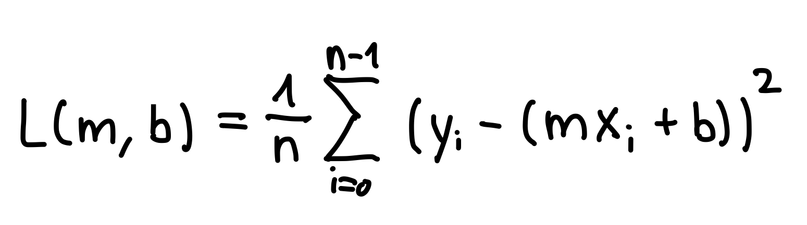

Let's look at a couple of illustrations to visualize these concepts.

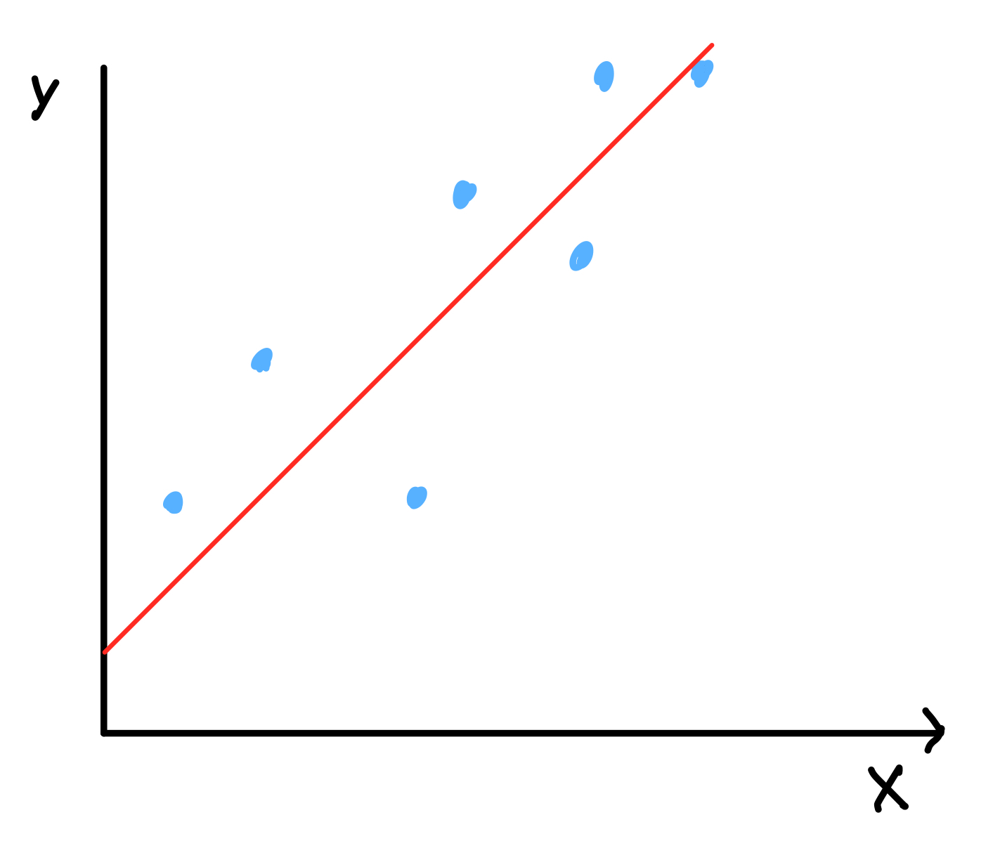

\
\
Given some data points, here in blue, we're trying to find this red line that fits best to all points.

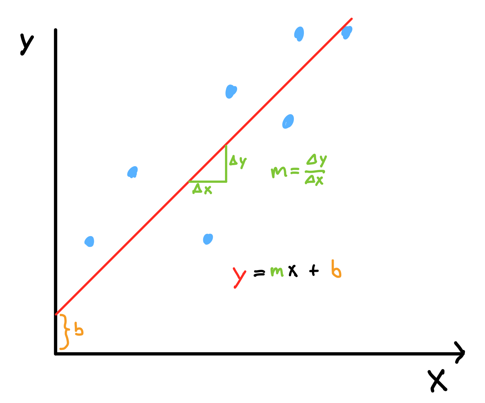

In this image we can see that we can adjust two parameters to make this line fit our data: the slope *m* and the y-intercept *b*.

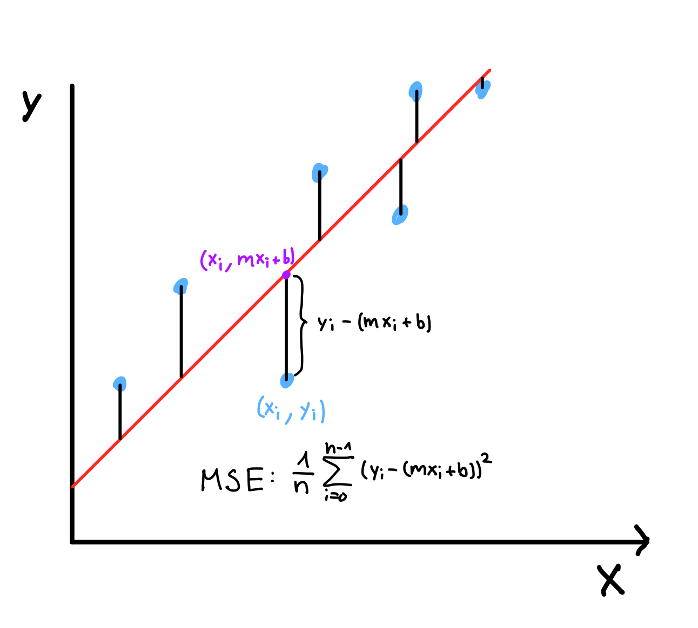

In this illustration we can visualize the meaning of the MSE. In purple we can see the prediction *mx<sub>i</sub> + b* at a point *x*<sub>*i*</sub>. The true value at that point is given by the blue points' y-value *y<sub>i</sub>*. The difference of the true value and the prediction gives us the error for one point (*y<sub>i</sub> - (mx<sub>i</sub> + b)*). To get the error for our entire dataset we square that value to get rid of any negative values, so the positive and negative values don't cancel out, and then sum the error of every point. At the end we normalize the error by dividing by the length of the dataset *n*.

Now that we know how the loss is calculated, let's explore two ways to minimize the error: The closed-form solution and gradient descent.

## Optimization

### Gradient descent

Gradient descent is an optimization technique that starts with some initial guess (or random values) for its parameters, in this case m and b, and adjusts them iteratively. This iterative approach is the reason why gradient descent is used in more complex machine learning model, where finding an analytical solution is often impossible.

#### How does it work?

Gradient descent works by finding the "direction of steepest descent" on the loss function. At each step, we calculate the gradient of the loss function, which tells us how the error changes with respect to the parameters m and b. This gradient points in the direction where the loss increases the fastest. To minimize the loss, we move in the opposite direction of the gradient.

Imagine the loss function as a bowl-shaped surface, where the height represents the error. The gradient is like a compass pointing uphill, and the "steepest descent" is the opposite direction—downhill. By taking small steps in this direction, guided by the learning rate *α*, we iteratively find the minimum of the loss function.

The learning rate shouldn't be too small, because with very tiny steps, finding the way "down-hill" takes a long time. On the other hand the learning rate also shouldn't be too big, because by taking large steps we risk overshooting the minimum and going "up-hill" on the other side of the minimum.

#### How do you find the gradient?

To find the gradient we simply take the partial derivative of the loss function with respect to each variable. In this case we only have to find two partial derivatives: One with respect to *m* and one with respect to *b*. The partial derivatives measure how sensitive the loss is to changes in each parameter and can be calculated by using the chain rule and the power rule from calculus as shown in the calculations below. 

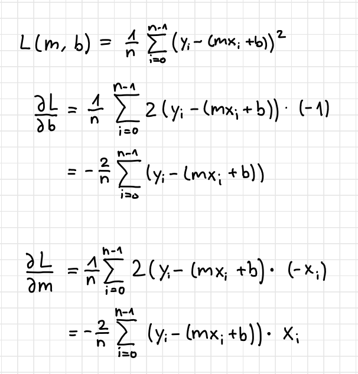

Now that we calculated the partial derivatives we can use them to iteratively adjust our parameters using the following update rules:

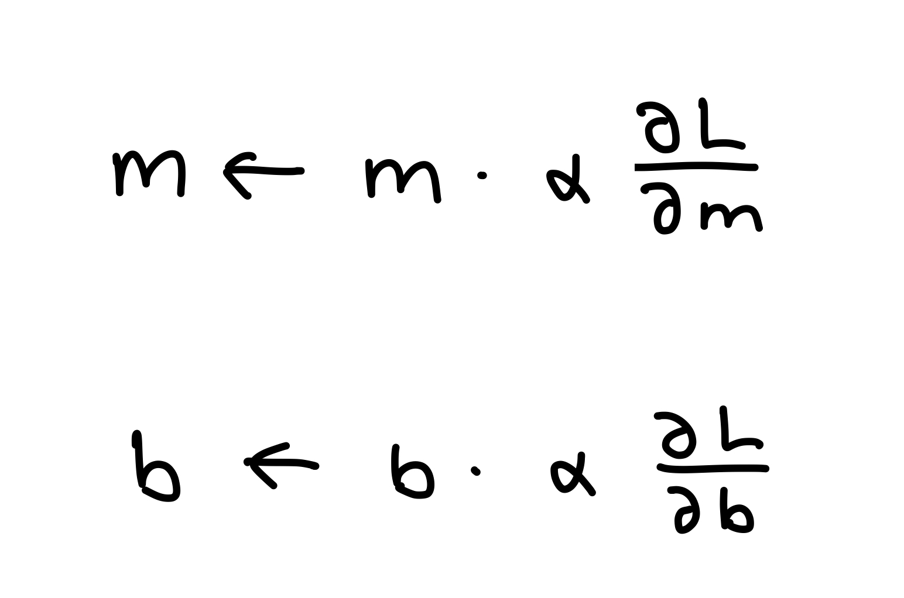

### Closed-Form Solution

Finding the closed-form solution is an analytical approach alternative to gradient descent to optimize the loss function. It offers an exact solution for the parameters *a* and *b* in one step. For a simple model, like linear regression, and a small dataset it's computationally efficient, but as complexity and size of the dataset grow, finding the closed-form solution become inefficient or even impossible.

#### How does it work?

In optimization, partial derivatives measure how a function changes with respect to each parameter. To find the minimum of the loss function, we need to identify where the function stops decreasing—this happens when the slope is zero. For the Mean Squared Error (MSE), this means setting the partial derivatives with respect to m and b to zero:

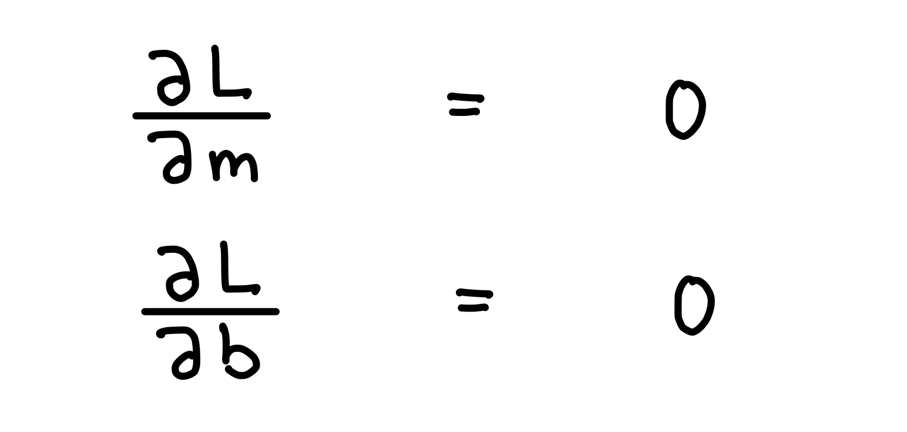

Imagine the loss function as a 3D bowl-shaped surface where the height represents the error. The minimum is at the bottom of the bowl, where the slope is zero in every direction. Mathematically, this is where the partial derivatives of the loss function are zero.

#### How do you find the optimal parameters?

To find *m* and *b* we can set their partial derivatives equal to zero and we get a 2x2 system of equations. If we solve this system of equations we find the optimal values for both parameters. The formulas for *m* and *b* are:

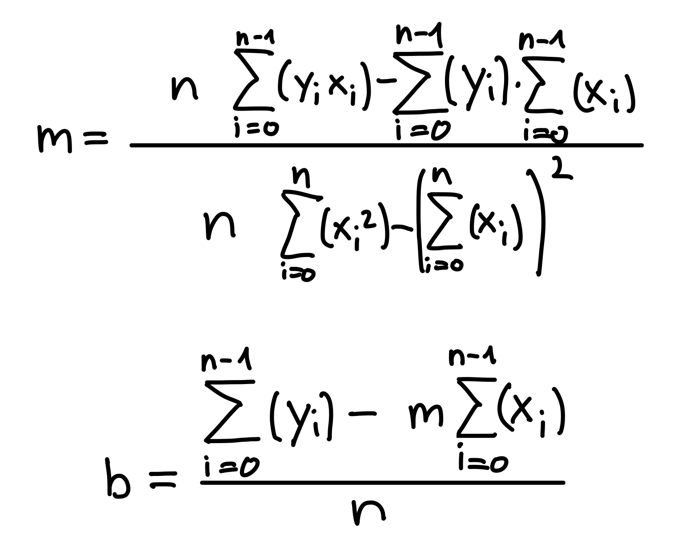

Here is how to solve this 2x2 system of equations to get to these formulas:

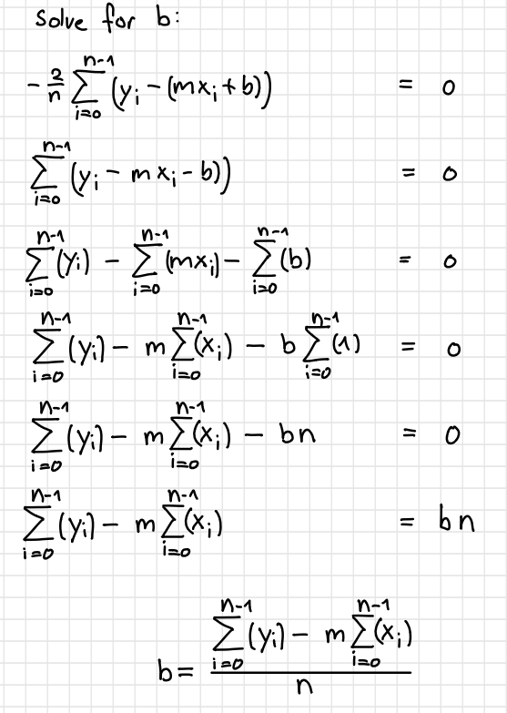

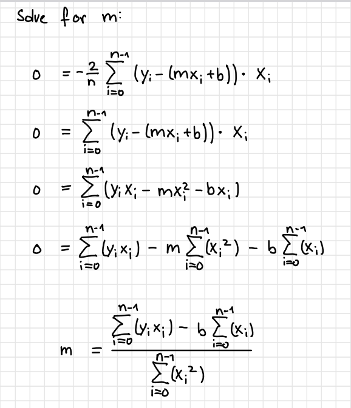

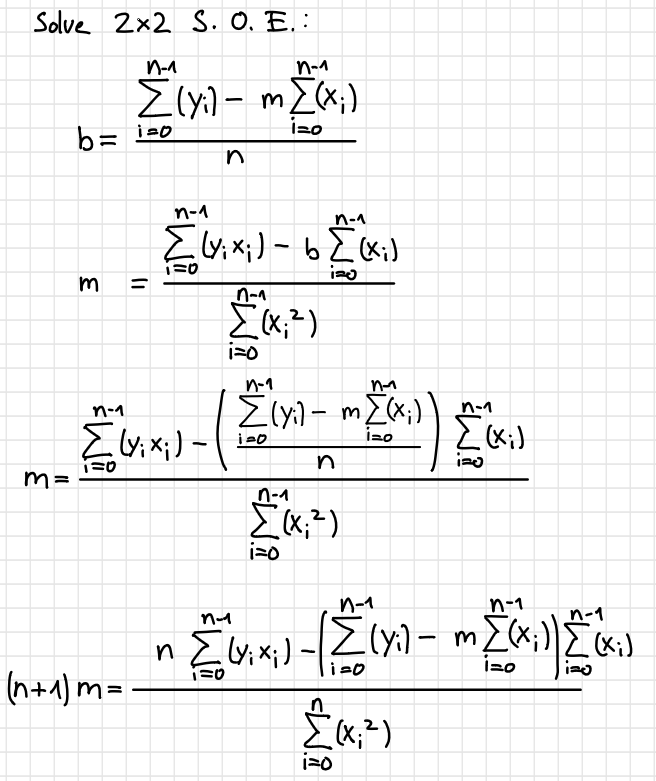

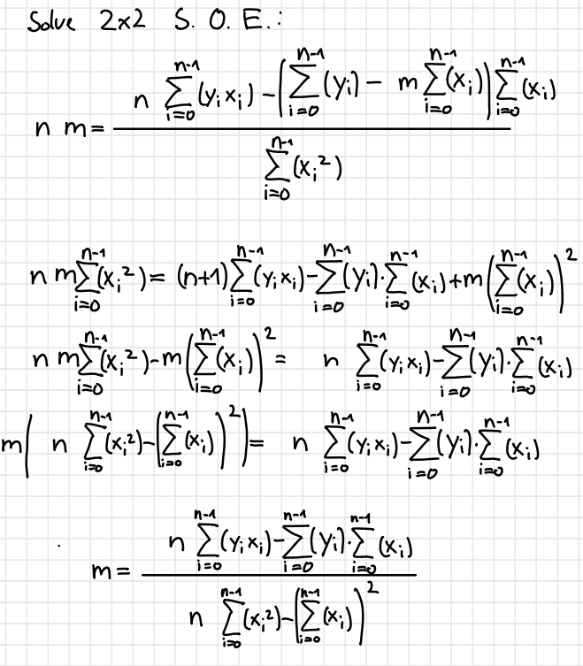

Now let's see how we would implement both of these approached in Python.

# Implementation in Python

I started by generating some data. I used a lambda function to create a "true" relationship *y = -3x + 10*. I then added some random noise that reflects the natural variability you would see in real-world data.

```
import numpy as np
import random

random.seed(0)

assignment_function = lambda x: -3 * x + 10

data = np.array([(x/2, assignment_function(x/2) + random.randint(-1000, 1000) * 0.01)  for x in range(100)])
```

Moving on, I implemented the MSE as our loss function:

```
def mean_squared_error(m, b, data):
    total_error = 0
    for i in range(len(data)):
        x = data[i, 0]
        y = data[i, 1]
        total_error += (y - (m * x + b)) ** 2
    return total_error / len(data)
```

I then wrote two functions for both approaches we discussed:

```
def gradient_descent(current_m, current_b, data, learning_rate):
    m_gradient = 0
    b_gradient = 0
    n = len(data)
    for i in range(n):
        x = data[i, 0]
        y = data[i, 1]
        m_gradient += -(2/n) * x * (y - (current_m * x + current_b))
        b_gradient += -(2/n) * (y - (current_m * x + current_b))
    
    new_m = current_m - (learning_rate * m_gradient) 
    new_b = current_b - (learning_rate * b_gradient)
    return new_m, new_b

def closed_form_solution(data):
    x = data[:, 0]
    y = data[:, 1]
    n = len(data)
    m = (n * np.sum(x * y) - np.sum(x) * np.sum(y)) / (n * np.sum(x ** 2) - (np.sum(x) ** 2))
    b = (np.sum(y) - m * np.sum(x)) / n
    return m, b
```

To try both of our approaches I computed the parameters using both functions:

```
m = 0
b = 0
lr = 0.001

# Run gradient descent 10,000 times
for i in range(10000):
    m, b = gradient_descent(m, b, data, lr)

# Get the optimal values of m and b
optimal_m, optimal_b = closed_form_solution(data)


print("Gradient Descent:")
print("m:", m, "b:", b)
print("Error:", mean_squared_error(m, b, data))

print("________________________")

print("Closed Form:")
print("m:", optimal_m, "b:", optimal_b)
print("Error:", mean_squared_error(optimal_m, optimal_b, data))
```

After running the code I got the following results:

```
Gradient Descent:
m: -3.005955615817557 b: 11.278531884074836
Error: 34.38766295184873
________________________
Closed Form:
m: -3.0081170117011693 b: 11.350196039603935
Error: 34.38635965783978
```

As we can see both approaches delivered very similar results with the closed-form solution method having a slightly lower error, which makes sense as it computes the optimal parameters.

To visualize the results I plotted the points and the regression lines:

```
import matplotlib.pyplot as plt

x = data[:, 0]
y = data[:, 1]


plt.figure(figsize=(10, 10))
plt.scatter(x, y)
plt.plot(x, optimal_m * x + optimal_b, color='green', label='Closed Form', linewidth=4)
plt.plot(x, m * x + b, color='red', label='Gradient Descent', linewidth=2)
plt.title('Comparison of Gradient Descent and Closed Form')
plt.legend()
plt.show()
```

The results show that both approaches worked nicely.

# **Why Gradient Descent Dominates Machine Learning**

Since the close-form solution finds the optimal parameters to find the minimum of the loss function it could seem like it's the better option for machine learning. So you might ask yourself: Why is gradient descent dominant in the field of ML? While the closed-form solution is efficient for small datasets and simple models like linear regression, gradient descent dominates machine learning due to its scalability, flexibility, and ability to handle more complex scenarios.

## 1. Scalability

Gradient descent is inherently scalable to large datasets and high-dimensional problems. While the closed-form solution requires computing multiple sums over the entire dataset, which can become computationally expensive for large data, gradient descent processes the data iteratively. This means it can handle datasets that are too large to fit into memory by updating the parameters in smaller steps. For datasets with millions of rows and features, gradient descent is the practical choice.

## 2. Flexibility

Gradient descent works for a wide range of machine learning models, not just linear regression. For example, logistic regression, support vector machines, and neural networks all rely on gradient descent or its variants to optimize their parameters. These models often involve loss functions that cannot be minimized analytically, making gradient descent the only viable solution.

## 3. Adaptability with Variants

Gradient descent has evolved with many variants tailored for different use cases:

* **Stochastic Gradient Descent (SGD)** processes one data point at a time, making it faster for very large datasets.
* **Mini-Batch Gradient Descent** strikes a balance by processing small subsets of the data at each step.

## 4. Handling Complex Loss Functions

Many machine learning models have non-convex loss functions with multiple local minima. Gradient descent can navigate these complex landscapes effectively, converging to good solutions even when an exact minimum cannot be found.

## Practical Trade-Offs

Even though gradient descent only approximates the minimum of the loss function, it excels in real-world scenarios. The closed-form solution, on the other hand, is limited to simple models and becomes impractical for large datasets or complex models.

# Conclusion

Linear regression serves as the perfect introduction to understanding the optimization techniques that form the basis of machine learning. By comparing the **closed-form solution** and **gradient descent**, we've explored two powerful approaches to solving this foundational problem.

The closed-form solution is elegant and efficient for small, simple datasets, providing exact results in a single calculation. However, as we've seen, its limitations become apparent as datasets grow larger or models increase in complexity. For linear regression, the closed-form solution shines, but its practicality fades when scalability and flexibility are required.

Gradient descent, on the other hand, emerges as the foundation of modern machine learning. Its ability to handle large datasets, adapt to complex models, and scale with high-dimensional problems makes it indispensable. By iteratively improving parameters and offering variants like stochastic and mini-batch gradient descent, this method provides the flexibility and robustness needed to tackle real-world challenges. While gradient descent may approximate the solution rather than calculate it exactly, its iterative approach and compatibility with non-linear models ensure it remains at the heart of machine learning optimization.

In conclusion, while both methods perform well for linear regression, gradient descent's dominance stems from its scalability, adaptability, and versatility. Mastering both approaches not only deepens your understanding of optimization but also equips you with tools to explore more advanced machine learning techniques. Whether you're building simple predictive models or training deep neural networks, the principles discussed here lay a solid foundation for your journey into the world of machine learning.